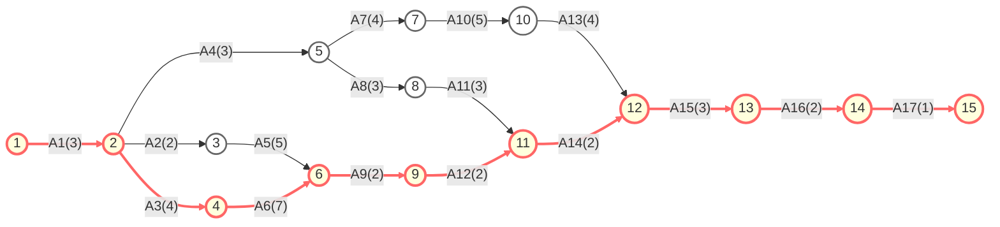

# 1. 分工与进度估算

| 事件编号 | 事件描述           | 活动编号 | 活动描述         | 后继事件 | 活动持续时间（天） |
| :------: | :--------------- | :------: | :------------- | :------: | :--------------: |
|   $V1$   | 项目启动          |   $A1$   | 需求分析         |   $V2$   |       $3$        |
|   $V2$   | 需求分析完成       |   $A2$   | 项目计划制定      |   $V3$   |       $2$        |
|   $V2$   | 需求分析完成       |   $A3$   | 数据库设计       |   $V4$   |       $4$        |
|   $V2$   | 需求分析完成       |   $A4$   | 系统架构设计      |   $V5$   |       $3$        |
|   $V3$   | 项目计划制定完成    |   $A5$   | 用户管理模块开发   |   $V6$   |       $5$        |
|   $V4$   | 数据库设计完成     |   $A6$   | 充值消费模块开发   |   $V6$   |       $7$        |
|   $V5$   | 系统架构设计完成    |   $A7$   | 前端界面设计      |   $V7$   |       $4$        |
|   $V5$   | 系统架构设计完成    |   $A8$   | JWT认证与授权实现  |   $V8$   |       $3$        |
|   $V6$   | 核心模块开发完成    |   $A9$   | 单元测试         |   $V9$   |       $2$        |
|   $V7$   | 前端界面设计完成    |  $A10$   | 前端页面实现      |  $V10$   |       $5$        |
|   $V8$   | 认证授权实现完成    |  $A11$   | API集成         |  $V11$   |       $3$        |
|   $V9$   | 单元测试完成       |  $A12$   | 性能测试         |  $V11$   |       $2$        |
|  $V10$   | 前端页面实现完成    |  $A13$   | 前后端联调       |  $V12$   |       $4$        |
|  $V11$   | 测试集成完成       |  $A14$   | 系统部署         |  $V12$   |       $2$        |
|  $V12$   | 系统部署完成       |  $A15$   | 用户测试         |  $V13$   |       $3$        |
|  $V13$   | 用户测试完成       |  $A16$   | 项目文档完善      |  $V14$   |       $2$        |
|  $V14$   | 文档完善完成       |  $A17$   | 项目总结与优化     |  $V15$   |       $1$        |

# 2. 关键路径分析

|   事件   | $earliest(i)$ | $latest(i)$ |
| :----: | :--------------------------: | :------------------------: |
| $V1$​  |             $0$              |            $0$             |
| $V2$​  |             $3$              |            $3$             |
| $V3$​  |             $5$              |            $9$             |
| $V4$​  |             $7$              |            $7$             |
| $V5$​  |             $6$              |            $7$             |
| $V6$​  |             $14$             |            $14$            |
| $V7$​  |             $10$             |            $11$            |
| $V8$​  |             $9$              |            $15$            |
| $V9$​  |             $16$             |            $16$            |
| $V10​$ |             $15$             |            $16$            |
| $V11$​ |             $18$             |            $18$            |
| $V12$​ |             $20$             |            $20$            |
| $V13$​ |             $23$             |            $23$            |
| $V14$​ |             $25$             |            $25$            |
| $V15$  |             $26$             |            $26$            |

---

|   活动   | $early(i)$ | $late(i)$ |  关键路径   |
| :----: | :-----------------------: | :----------------------: | :-----: |
| $A1$​  |            $0$            |           $0$            | * |
| $A2$​  |            $3$            |           $7$            |         |
| $A3$​  |            $3$            |           $3$            | * |
| $A4$​  |            $3$            |           $4$            |         |
| $A5$​  |            $5$            |           $9$            |         |
| $A6​$  |            $7$            |           $7$            | * |
| $A7​$  |            $6$            |           $7$            |         |
| $A8$​  |            $6$            |           $12$            |         |
| $A9$​  |           $14$            |           $14$           | * |
| $A10​$ |           $10$            |           $11$           |         |
| $A11$​ |            $9$            |           $15$           |         |
| $A12$​ |           $16$            |           $16$           | * |
| $A13$​ |           $15$            |           $16$           |         |
| $A14$​ |           $18$            |           $18$           | * |
| $A15$​ |           $20$            |           $20$           | * |
| $A16$​ |           $23$            |           $23$           | * |
| $A17$​ |           $25$            |           $25$           | * |