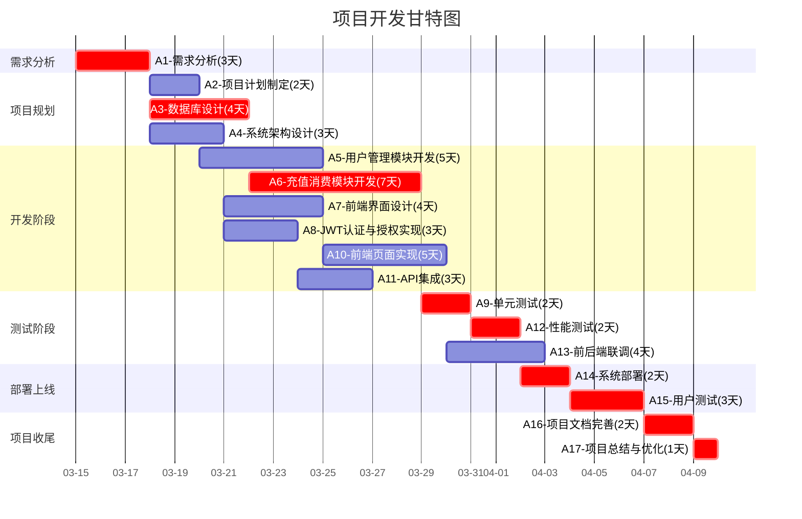

# 项目甘特图

## 项目概览
- **项目总工期**: 26天
- **关键路径**: V1→V2→V4→V6→V9→V11→V12→V13→V14→V15
- **关键活动**: A1, A3, A6, A9, A12, A14, A15, A16, A17

## 甘特图

## 详细时间安排

### 第1-3天：需求分析阶段
| 活动 | 开始时间 | 结束时间 | 持续时间 | 状态 |
|------|----------|----------|----------|------|
| A1-需求分析 | 3月15日 | 3月17日 | 3天 | * 关键路径 |

### 第3-7天：设计阶段
| 活动 | 开始时间 | 结束时间 | 持续时间 | 状态 |
|------|----------|----------|----------|------|
| A2-项目计划制定 | 3月18日 | 3月19日 | 2天 | 非关键 |
| A3-数据库设计 | 3月18日 | 3月21日 | 4天 | * 关键路径 |
| A4-系统架构设计 | 3月18日 | 3月20日 | 3天 | 非关键 |

### 第5-15天：开发阶段
| 活动 | 开始时间 | 结束时间 | 持续时间 | 状态 |
|------|----------|----------|----------|------|
| A5-用户管理模块开发 | 3月20日 | 3月24日 | 5天 | 非关键 |
| A6-充值消费模块开发 | 3月22日 | 3月28日 | 7天 | * 关键路径 |
| A7-前端界面设计 | 3月21日 | 3月24日 | 4天 | 非关键 |
| A8-JWT认证与授权实现 | 3月21日 | 3月23日 | 3天 | 非关键 |
| A10-前端页面实现 | 3月25日 | 3月29日 | 5天 | 非关键 |
| A11-API集成 | 3月24日 | 3月26日 | 3天 | 非关键 |

### 第14-20天：测试与集成阶段
| 活动 | 开始时间 | 结束时间 | 持续时间 | 状态 |
|------|----------|----------|----------|------|
| A9-单元测试 | 3月29日 | 3月30日 | 2天 | * 关键路径 |
| A12-性能测试 | 3月31日 | 4月1日 | 2天 | * 关键路径 |
| A13-前后端联调 | 3月30日 | 4月2日 | 4天 | 非关键 |
| A14-系统部署 | 4月2日 | 4月3日 | 2天 | * 关键路径 |

### 第20-26天：上线与收尾阶段
| 活动 | 开始时间 | 结束时间 | 持续时间 | 状态 |
|------|----------|----------|----------|------|
| A15-用户测试 | 4月4日 | 4月6日 | 3天 | * 关键路径 |
| A16-项目文档完善 | 4月7日 | 4月8日 | 2天 | * 关键路径 |
| A17-项目总结与优化 | 4月9日 | 4月9日 | 1天 | * 关键路径 |

## 里程碑节点

| 里程碑 | 时间节点 | 描述 |
|--------|----------|------|
| 项目启动 | 3月15日 | 项目正式启动 |
| 需求确认 | 3月18日 | 需求分析完成，进入设计阶段 |
| 设计完成 | 3月22日 | 数据库设计完成，核心架构确定 |
| 开发完成 | 3月29日 | 核心模块开发完成 |
| 测试完成 | 4月2日 | 所有测试完成，系统可部署 |
| 系统上线 | 4月4日 | 系统部署完成 |
| 项目交付 | 4月9日 | 项目完成交付 |

### 风险提醒
**关键路径风险**：以下活动延期将直接影响项目整体进度
- A1需求分析
- A3数据库设计  
- A6充值消费模块开发
- A9单元测试
- A12性能测试
- A14系统部署
- A15用户测试
- A16项目文档完善
- A17项目总结与优化

### 项目监控要点
1. **3月18日检查点**: 需求分析是否按时完成
2. **3月22日检查点**: 数据库设计是否达到开发要求
3. **3月29日检查点**: 核心模块开发质量评估
4. **4月2日检查点**: 测试结果评审
5. **4月4日检查点**: 部署验收
6. **4月9日检查点**: 项目最终交付

---

**备注**: 
- *关键路径 表示关键路径活动，需重点关注
- 非关键 表示非关键路径活动，有一定缓冲时间
- 项目总工期为26天，任何关键路径活动的延期都会影响项目交付时间