# 项目甘特图

## 项目概览
- **项目总工期**: 26天
- **关键路径**: V1→V2→V4→V6→V9→V11→V12→V13→V14→V15
- **关键活动**: A1, A3, A6, A9, A12, A14, A15, A16, A17

## 甘特图

```mermaid
gantt
    title 项目开发甘特图
    dateFormat  X
    axisFormat 第%d天
    
    section 需求分析
    A1-需求分析(3天)           :crit, a1, 0, 3
    
    section 项目规划
    A2-项目计划制定(2天)       :a2, 3, 5
    A3-数据库设计(4天)         :crit, a3, 3, 7
    A4-系统架构设计(3天)       :a4, 3, 6
    
    section 开发阶段  
    A5-用户管理模块开发(5天)   :a5, 5, 10
    A6-充值消费模块开发(7天)   :crit, a6, 7, 14
    A7-前端界面设计(4天)       :a7, 6, 10
    A8-JWT认证与授权实现(3天)  :a8, 6, 9
    A10-前端页面实现(5天)      :a10, 10, 15
    A11-API集成(3天)           :a11, 9, 12
    
    section 测试阶段
    A9-单元测试(2天)          :crit, a9, 14, 16
    A12-性能测试(2天)         :crit, a12, 16, 18
    A13-前后端联调(4天)       :a13, 15, 19
    
    section 部署上线
    A14-系统部署(2天)         :crit, a14, 18, 20
    A15-用户测试(3天)         :crit, a15, 20, 23
    
    section 项目收尾
    A16-项目文档完善(2天)     :crit, a16, 23, 25
    A17-项目总结与优化(1天)   :crit, a17, 25, 26
```

## 详细时间安排

### 第1-3天：需求分析阶段
| 活动 | 开始时间 | 结束时间 | 持续时间 | 状态 |
|------|----------|----------|----------|------|
| A1-需求分析 | 第0天 | 第3天 | 3天 | * 关键路径 |

### 第3-7天：设计阶段
| 活动 | 开始时间 | 结束时间 | 持续时间 | 状态 |
|------|----------|----------|----------|------|
| A2-项目计划制定 | 第3天 | 第5天 | 2天 | 非关键 |
| A3-数据库设计 | 第3天 | 第7天 | 4天 | * 关键路径 |
| A4-系统架构设计 | 第3天 | 第6天 | 3天 | 非关键 |

### 第5-15天：开发阶段
| 活动 | 开始时间 | 结束时间 | 持续时间 | 状态 |
|------|----------|----------|----------|------|
| A5-用户管理模块开发 | 第5天 | 第10天 | 5天 | 非关键 |
| A6-充值消费模块开发 | 第7天 | 第14天 | 7天 | * 关键路径 |
| A7-前端界面设计 | 第6天 | 第10天 | 4天 | 非关键 |
| A8-JWT认证与授权实现 | 第6天 | 第9天 | 3天 | 非关键 |
| A10-前端页面实现 | 第10天 | 第15天 | 5天 | 非关键 |
| A11-API集成 | 第9天 | 第12天 | 3天 | 非关键 |

### 第14-20天：测试与集成阶段
| 活动 | 开始时间 | 结束时间 | 持续时间 | 状态 |
|------|----------|----------|----------|------|
| A9-单元测试 | 第14天 | 第16天 | 2天 | * 关键路径 |
| A12-性能测试 | 第16天 | 第18天 | 2天 | * 关键路径 |
| A13-前后端联调 | 第15天 | 第19天 | 4天 | 非关键 |
| A14-系统部署 | 第18天 | 第20天 | 2天 | * 关键路径 |

### 第20-26天：上线与收尾阶段
| 活动 | 开始时间 | 结束时间 | 持续时间 | 状态 |
|------|----------|----------|----------|------|
| A15-用户测试 | 第20天 | 第23天 | 3天 | * 关键路径 |
| A16-项目文档完善 | 第23天 | 第25天 | 2天 | * 关键路径 |
| A17-项目总结与优化 | 第25天 | 第26天 | 1天 | * 关键路径 |

## 里程碑节点

| 里程碑 | 时间节点 | 描述 |
|--------|----------|------|
| 项目启动 | 第0天 | 项目正式启动 |
| 需求确认 | 第3天 | 需求分析完成，进入设计阶段 |
| 设计完成 | 第7天 | 数据库设计完成，核心架构确定 |
| 开发完成 | 第14天 | 核心模块开发完成 |
| 测试完成 | 第18天 | 所有测试完成，系统可部署 |
| 系统上线 | 第20天 | 系统部署完成 |
| 项目交付 | 第26天 | 项目完成交付 |

### 风险提醒
**关键路径风险**：以下活动延期将直接影响项目整体进度
- A1需求分析
- A3数据库设计  
- A6充值消费模块开发
- A9单元测试
- A12性能测试
- A14系统部署
- A15用户测试
- A16项目文档完善
- A17项目总结与优化

### 项目监控要点
1. **第3天检查点**: 需求分析是否按时完成
2. **第7天检查点**: 数据库设计是否达到开发要求
3. **第14天检查点**: 核心模块开发质量评估
4. **第18天检查点**: 测试结果评审
5. **第20天检查点**: 部署验收
6. **第26天检查点**: 项目最终交付

---

**备注**: 
- *关键路径 表示关键路径活动，需重点关注
- 非关键 表示非关键路径活动，有一定缓冲时间
- 项目总工期为26天，任何关键路径活动的延期都会影响项目交付时间